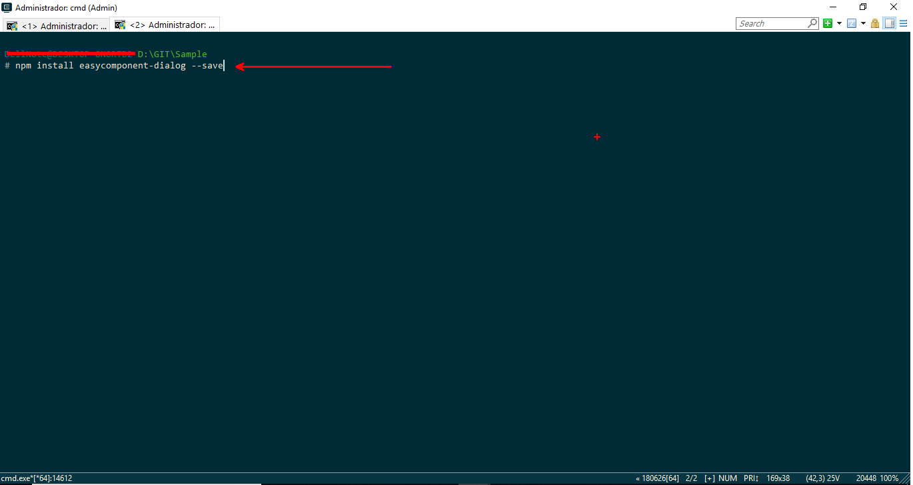
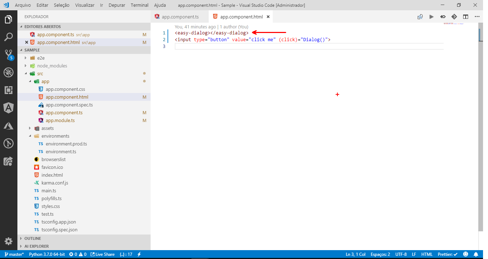
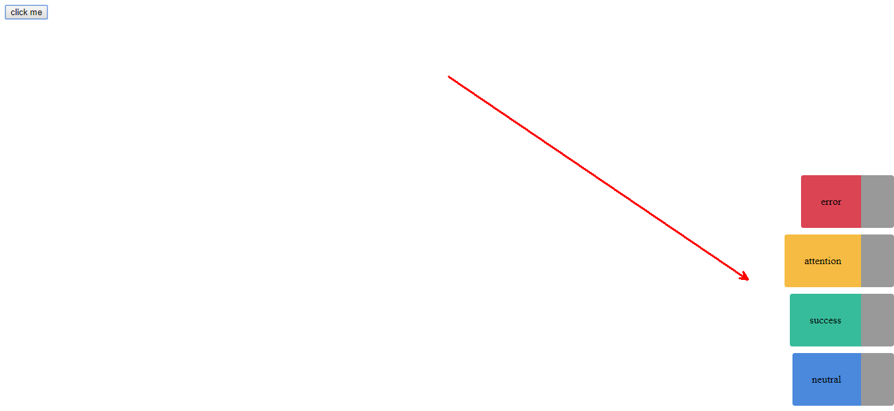

See the step by step to use the Dialog

1- npm install easycomponent-dialog --save

2- In the angular module you have declare DialogComponent

3- In the .ts file , you have to create a   @ViewChild(DialogComponent) dialogSample: DialogComponent;
Use the Dialog method with 3 parameters

1-Message

2-Message type (error,attention,success,neutral)

3-time to close

4- In the html file just add   

5- Voila!!

